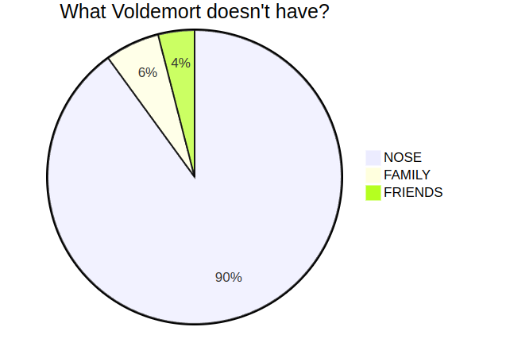

+++
author = "Abu Adbullah"
title = "Тест медиа"
date = "2024-03-27"
description = "Тест медиа"
tags = [
    "emoji",
]
+++

Понятие религии это достаточно сложное и разнообразное и во многом субъективное понятие. Тем не менее, мы постараемся сгруппировать существующие взгляды именно в таком разрезе, который будет более подходящим для наших целей.

В общем, взгляды на религию как понятие можно разделить на внутренние и внешние, с точки зрения человека, который эти взгляды выражает. В качестве аналогии, для понимания, мы можем вспомнить о том, что у многих существующих народов присутствует как собственное название, так и экзоним - имя, которым данный народ называют другие народы. Например тех, кто себя называют “эллинес”, мы называем греками, а грузины называют себя “картвели”. И таких примеров много.

[001001.mp3](..%2F..%2F..%2F..%2FDownloads%2F001001.mp3)
